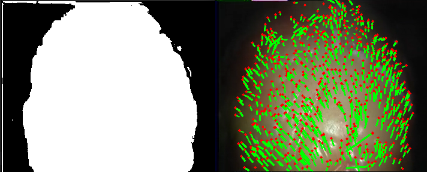

<h1> Sparse Template Based Reconstruction </h1>

# Todo 
* Code optimization
* Provide used data
* Docker file
* Troubleshooting with docker
* Acknowledgments
    * Which work did I use
        * ParallaxBA
        * DefSLAM
        * phi-SfT
        * Robust-SfT
    * Which data did I use

## Overview

### Features

### Acknowledgements

### Examples

## Installation
### Dependencies
<ul>
    <li>C++17</li>
    <li>OpenCV-4.5.0</li>
    <li>Eigen-3.3</li>
    <li>Open3D-0.18.0</li>
    <li>Pangolin-0.9</li>
    <li>Suitsparse</li>
</ul>

## Currently working on
- Docker implementation
- Writing the Readme
-- Reference to the datasets which I used!
- using von spdlog!
- refactoring of optimization
- commenting

## License

This project is licensed under the [GNU General Public License (GPL)](https://www.gnu.org/licenses/gpl-3.0.html).

## Reference